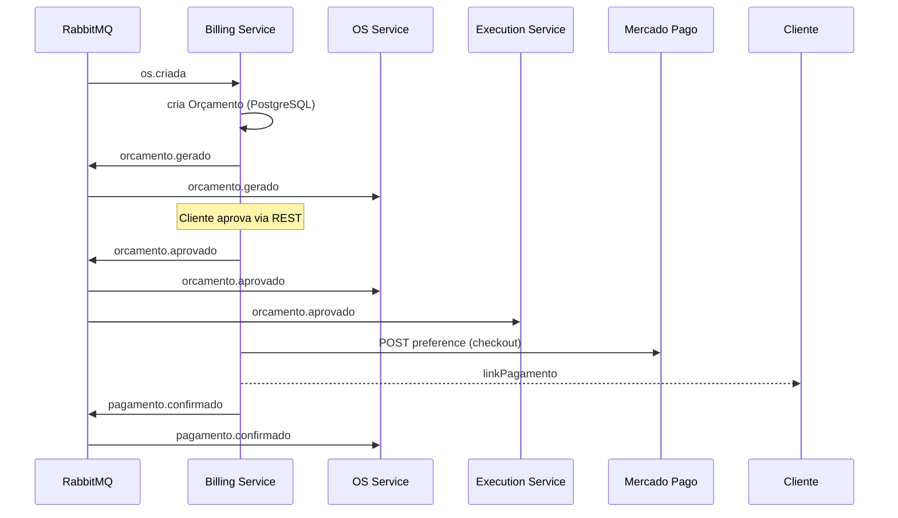
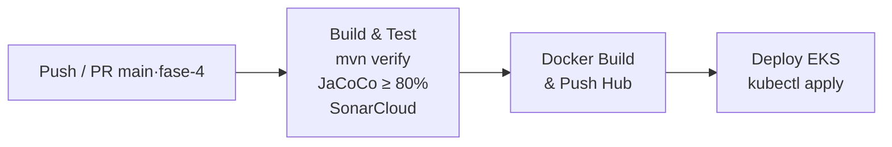

# Billing Service — Orçamentos e Pagamentos

[](https://www.oracle.com/java/)
[](https://spring.io/projects/spring-boot)
[](https://www.postgresql.org/)
[](https://www.rabbitmq.com/)
[](#testes-e-qualidade)
[](https://github.com/VitorVieira12/tech-challenge-billing-service/actions/workflows/ci-cd-billing-service.yml)

Microsserviço do **bounded context financeiro** do Tech Challenge — FIAP Pós Tech (13SOAT) — Fase 4.

Responsável por orçamentos, aprovação/rejeição pelo cliente, integração com **Mercado Pago** e publicação de eventos que alimentam o Saga coreografado.

| Repositório relacionado | Papel no Saga |
|---|---|
| [Tech-Challenge](https://github.com/VitorVieira12/Tech-Challenge) (OS Service) | Dono da OS — consome eventos do Billing |
| [tech-challenge-execution-service](https://github.com/VitorVieira12/tech-challenge-execution-service) | Fila de execução — consome `orcamento.aprovado` |

Arquitetura completa (3 serviços): [`Tech-Challenge/docs/ARQUITETURA_FASE4.md`](https://github.com/VitorVieira12/Tech-Challenge/blob/fase-4/docs/ARQUITETURA_FASE4.md).

---

## Papel no Saga (coreografado)

O Billing **não orquestra** o fluxo — reage a eventos e publica novos eventos no RabbitMQ.



### Eventos

| Direção | Routing key | Exchange | Descrição |
|---|---|---|---|
| Consome | `os.criada` | `os.events` | Gera orçamento automaticamente |
| Publica | `orcamento.gerado` | `billing.events` | OS → `AGUARDANDO_APROVACAO` |
| Publica | `orcamento.aprovado` | `billing.events` | OS → `EM_EXECUCAO`; Execution entra na fila |
| Publica | `orcamento.rejeitado` | `billing.events` | Compensação: OS → `CANCELADA` |
| Publica | `pagamento.confirmado` | `billing.events` | OS registra pagamento nas observações |
| Publica | `pagamento.falhou` | `billing.events` | OS permanece aguardando novo pagamento |

**Banco de dados:** PostgreSQL 15 (schema `billing_service` no RDS) — isolado do OS Service e do Execution Service.

---

## Endpoints REST

Base URL local: `http://localhost:8081` · Swagger: `/swagger-ui.html`

### Orçamentos

| Método | Endpoint | Descrição |
|---|---|---|
| GET | `/orcamentos` | Listar todos |
| GET | `/orcamentos/{id}` | Buscar por ID |
| GET | `/orcamentos/os/{osId}` | Buscar pela OS |
| POST | `/orcamentos/{id}/aprovar` | Aprovar — publica `orcamento.aprovado` |
| POST | `/orcamentos/{id}/rejeitar?motivo=...` | Rejeitar — publica `orcamento.rejeitado` |

### Pagamentos (Mercado Pago)

| Método | Endpoint | Descrição |
|---|---|---|
| POST | `/pagamentos/link/{orcamentoId}` | Gera link de checkout no Mercado Pago |
| POST | `/pagamentos/webhook` | Webhook de notificação do MP (produção) |
| POST | `/pagamentos/confirmar/{osId}` | Confirma pagamento manual (sandbox/demo) |
| GET | `/pagamentos/orcamento/{orcamentoId}` | Listar pagamentos do orçamento |

### Exemplo — fluxo feliz após OS criada

```bash
# 1. Buscar orçamento gerado pelo evento os.criada
curl http://localhost:8081/orcamentos/os/7

# 2. Aprovar
curl -X POST http://localhost:8081/orcamentos/3/aprovar

# 3. Gerar link Mercado Pago
curl -X POST http://localhost:8081/pagamentos/link/3

# Resposta esperada (campos principais):
# {
#   "id": 1,
#   "orcamentoId": 3,
#   "osId": 7,
#   "valor": 450.00,
#   "status": "PENDENTE",
#   "linkPagamento": "https://www.mercadopago.com.br/checkout/v1/redirect?pref_id=..."
# }

# 4. Simular confirmação (demo / sandbox)
curl -X POST http://localhost:8081/pagamentos/confirmar/7
```

---

## Tecnologias

| Camada | Stack |
|---|---|
| Runtime | Java 21, Spring Boot 3.3.5 |
| Persistência | Spring Data JPA, PostgreSQL 15 |
| Mensageria | Spring AMQP, RabbitMQ |
| Pagamentos | API Mercado Pago (access token via env/secret) |
| API | SpringDoc OpenAPI 3 |
| Container | Docker, deploy no EKS |
| Qualidade | JUnit 5, Mockito, JaCoCo ≥ 80%, SonarCloud |

---

## Executar localmente

```bash
# Na raiz do monorepo OS (sobe Postgres Billing + RabbitMQ):
# cd ../Tech-Challenge && docker-compose up -d

export SPRING_DATASOURCE_URL=jdbc:postgresql://localhost:5433/billing_service
export SPRING_DATASOURCE_USERNAME=billing
export SPRING_DATASOURCE_PASSWORD=billing
export SPRING_RABBITMQ_HOST=localhost
export MERCADOPAGO_ACCESS_TOKEN=<seu_token_sandbox>

./mvnw spring-boot:run
```

Swagger: http://localhost:8081/swagger-ui.html

---

## Testes e qualidade

```bash
./mvnw verify   # testes + gate JaCoCo 80%
./mvnw test     # apenas unitários
```

| Categoria | Ferramenta | Observação |
|---|---|---|
| Unitários | JUnit 5 + Mockito | Services e controllers |
| Cobertura | JaCoCo (gate 80% LINE) | Exclui `messaging/`, `config/`, DTOs |
| Quality Gate | SonarCloud | `VitorVieira12_tech-challenge-billing-service` |

Relatório HTML: `target/site/jacoco/index.html`

---

## CI/CD e deploy (EKS)

Pipeline: [`.github/workflows/ci-cd-billing-service.yml`](.github/workflows/ci-cd-billing-service.yml)



1. Aplica `k8s/namespace.yaml`, `configmap.yaml`, `service.yaml`, `deployment.yaml`, `hpa.yaml`.
2. **Não aplica `k8s/secret.yaml`** — Secret criado no workflow a partir de GitHub Actions Secrets.
3. Atualiza a imagem do Deployment com a SHA do commit.

### GitHub Actions Secrets

| Secret | Descrição |
|---|---|
| `DOCKERHUB_USERNAME` / `DOCKERHUB_TOKEN` | Push da imagem |
| `AWS_ACCESS_KEY_ID` / `AWS_SECRET_ACCESS_KEY` | Acesso ao EKS |
| `SONAR_TOKEN` / `SONAR_HOST_URL` | SonarCloud |
| `BILLING_DB_URL` | JDBC do RDS (`.../billing_service`) |
| `BILLING_DB_USERNAME` / `BILLING_DB_PASSWORD` | Credenciais RDS |
| `RABBITMQ_USERNAME` / `RABBITMQ_PASSWORD` | RabbitMQ no cluster |
| `MERCADOPAGO_ACCESS_TOKEN` | Token sandbox ou produção |

> `k8s/secret.yaml.example` é só template para dev local. **Não aplique no cluster** — placeholders quebram a conexão com o RDS.

Branch `main` protegida — merge apenas via PR com checks verdes.

---

## Kubernetes

Manifests em [`k8s/`](k8s/):

- `namespace.yaml`, `configmap.yaml`, `deployment.yaml`, `service.yaml`, `hpa.yaml`
- `secret.yaml.example` — referência local

Namespace: `billing-service` · Porta do pod: `8081`

---

## Observabilidade

New Relic (agent no Dockerfile) — app name configurável via env. Distributed tracing com OS Service e Execution Service através do RabbitMQ.

---

## Entregáveis Fase 4 (este serviço)

| Item | Status |
|---|---|
| Microsserviço em repo próprio | ✅ |
| Banco SQL dedicado (PostgreSQL) | ✅ |
| Mensageria assíncrona | ✅ |
| Integração Mercado Pago | ✅ |
| Participação no Saga + compensação (`orcamento.rejeitado`) | ✅ |
| Testes unitários + cobertura ≥ 80% | ✅ |
| CI/CD com deploy EKS | ✅ |
| Swagger | ✅ |
